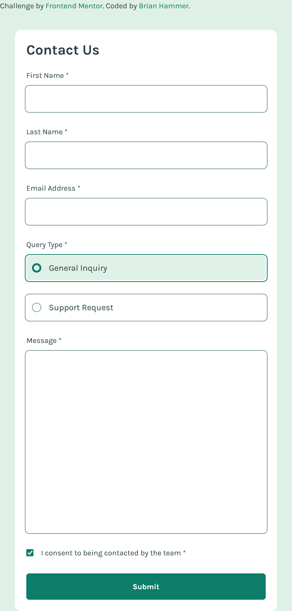
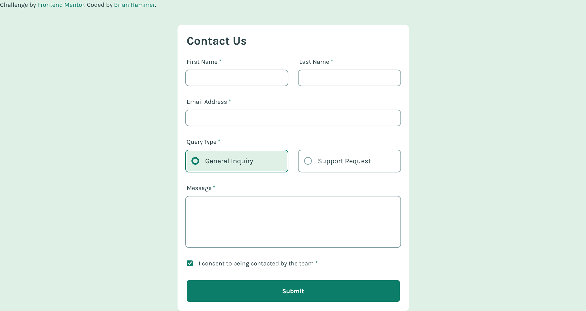

# Frontend Mentor - Contact form solution

This is a solution to the [Contact form challenge on Frontend Mentor](https://www.frontendmentor.io/challenges/contact-form--G-hYlqKJj). Frontend Mentor challenges help you improve your coding skills by building realistic projects.

## Table of contents

- [Overview](#overview)
  - [The challenge](#the-challenge)
  - [Screenshot](#screenshot)
  - [Links](#links)
  - [Built with](#built-with)
  - [What I learned](#what-i-learned)
  - [Continued development](#continued-development)
  - [Useful resources](#useful-resources)
- [Author](#author)

## Overview

This is a form card made using tailwind.

### The challenge

Users should be able to:

- Complete the form and see a success toast message upon successful submission
- Receive form validation messages if:
  - A required field has been missed
  - The email address is not formatted correctly
- Complete the form only using their keyboard
- Have inputs, error messages, and the success message announced on their screen reader
- View the optimal layout for the interface depending on their device's screen size
- See hover and focus states for all interactive elements on the page

### Screenshot

Mobile View

Desktop View

### Links

- Solution URL: [https://github.com/BrianHammer/form-component](https://github.com/BrianHammer/form-component)
- Live Site URL: [https://brianhammer.github.io/form-component/](https://brianhammer.github.io/form-component/)

### Built with

- HTML5
- Tailwind

### What I learned

I learned how to style various input components using tailwindCSS. I also learned some more advanced tailwind features such as using as the [:has] class when styling the radio component.

### Continued development

If I were to redesign this, I would use React with components so that the elements are reusable, and can easily be changed in one spot. I would also fix the error with the padding not working on the bottom.

### Useful resources

- [https://developer.mozilla.org/en-US/docs/Web/HTML/Element/input/radio#styling_radio_inputs](https://developer.mozilla.org/en-US/docs/Web/HTML/Element/input/radio#styling_radio_inputs) - This helped me to style the radio button and give it a cool animation.

## Author

- Frontend Mentor - [@BrianHammer](https://www.frontendmentor.io/profile/BrianHammer)
